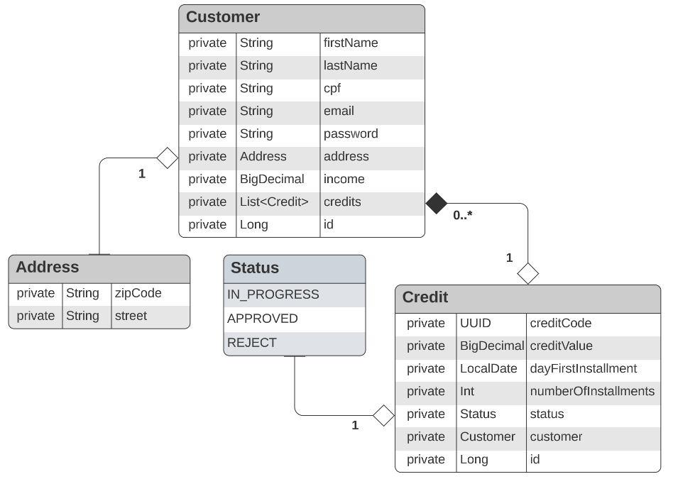

# Kotlin - Aplicação de um Sistema de Crédito




## 👨‍🚀 Projeto

O Kotlin Credit Application System é um sistema de aplicação de crédito desenvolvido em Kotlin, projetado para facilitar a análise e processamento de solicitações de crédito.
A aplicação é uma REST API criada utilizando a linguagem de programção Kotlin e o framework Spring

## 🚀 Tecnologias

- [Kotlin](https://kotlinlang.org/): linguagem de programação moderna usada para trabalhar com mais produtividade, possuindo uma sintaxe concisa e expressiva
- [Spring Framework](https://spring.io/): Framework utilizado para simplificar o desenvolvimento da Rest API desenvolvida com o Kotlin
- [Git](https://git-scm.com/): Sistema de versionamento de código utilizado para controlar as versões da aplicação

## 🌕 Iniciar a aplicação

Para iniciar a API REST do Spring na porta 8080 (**_http://localhost:8080/_**) basta seguir as intruções abaixo

```bash
# Clone o projeto em uma pasta local (na sua máquina)
git clone https://github.com/Brendon3578/kotlin-credit-application-system.git

# Execute o comando:
./gradlew bootrun
```

## 🔮 Utilitários usados na aplicação

- [Utilitários para configurações do Spring Boot](https://docs.spring.io/spring-boot/docs/2.0.x/reference/html/common-application-properties.html)
- [Gist no qual esse projeto foi feito sobre](https://gist.github.com/cami-la/560b455b901778391abd2c9edea81286#file-api-para-sistema-de-avaliacao-de-creditos-md)
- [Annotations do JPA](https://strn.com.br/artigos/2018/12/11/todas-as-anota%C3%A7%C3%B5es-do-jpa-anota%C3%A7%C3%B5es-de-mapeamento/)


<h3 align="center">
    Feito com ☕ por <a href="https://github.com/Brendon3578"> Brendon Gomes</a>
</h3>